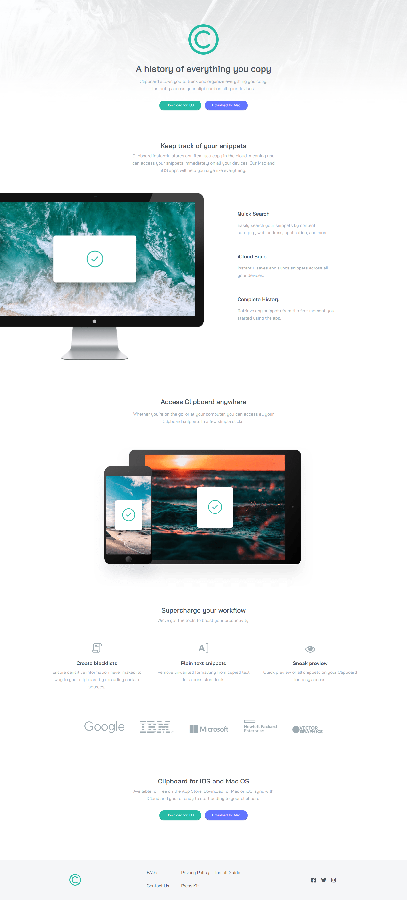
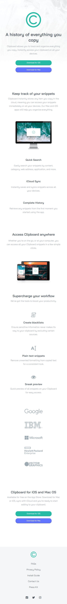

# Frontend Mentor - Clipboard landing page solution
  

### The challenge

Users should be able to:

- View the optimal layout for the app depending on their device's screen size
- See hover states for all interactive elements on the page

### Screenshot

Computer view

Mobile view

### Built with

- HTML5
- CSS
- Javascript
- Flexbox
- Grid

### What I learned

I feel like I'm having good progress with CSS Grid.